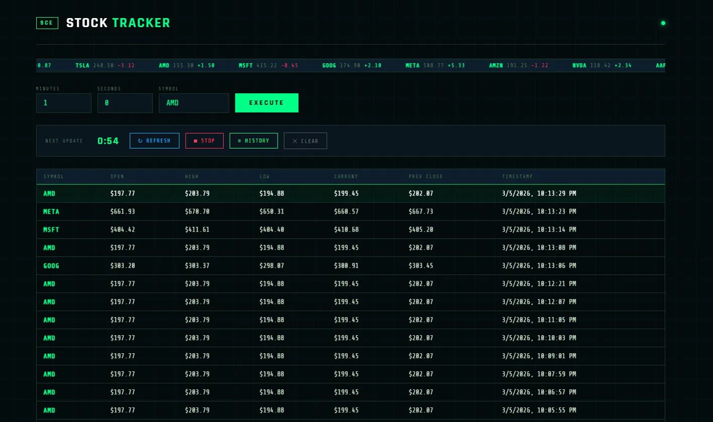

# Stock Tracker

A real-time stock monitoring dashboard. Enter a stock symbol and polling interval — the app fetches live market data from Finnhub and displays a running history table.

## Preview



## Tech Stack

- **Frontend** — React, CSS3
- **Backend** — Node.js, Express
- **API** — Finnhub (real-time stock quotes)
- **DevOps** — Docker, Docker Compose

## Features

- Live stock price polling at a user-defined interval (minutes + seconds)
- Persistent history table with newest entries on top, capped at 20 per symbol
- Multi-symbol support — monitor NVDA, then switch to AMD; History shows all
- Manual refresh resets the countdown and fetches immediately
- Stop, Clear, and History controls
- Server-side rate limiting, request timeouts, input validation, and concurrency guards
- API key never exposed to the frontend — all Finnhub calls go through the backend

## Getting Started

### Prerequisites
- Docker + Docker Compose
- A free [Finnhub API key](https://finnhub.io)

### Setup

1. Clone the repo
```bash
git clone https://github.com/mthinhngn/stocktracker.git
cd stocktracker
```

2. Create a `.env` file in the `backend/` folder
```bash
FINNHUB_API_KEY=your_api_key_here
```

3. Start both containers
```bash
docker-compose up -d --build
```

4. Open your browser
```
Frontend: http://localhost:3000
Backend:  http://localhost:5000
```

## API Endpoints

| Method | Endpoint | Description |
|--------|----------|-------------|
| POST | `/start-monitoring` | Begin polling a stock symbol |
| GET | `/history?symbol=` | Retrieve stored history |
| POST | `/refresh` | Immediate one-time fetch |
| POST | `/stop-monitoring` | Stop polling a symbol |
| GET | `/status` | List all symbols and rate limit usage |
| GET | `/health` | Health check |

## Environment Variables

| Variable | Description |
|----------|-------------|
| `FINNHUB_API_KEY` | Your Finnhub API key |
| `PORT` | Backend port (default: 5000) |
